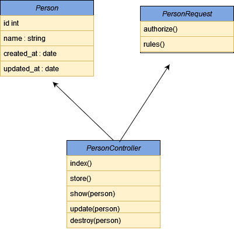

### Person API 

A simple REST API with CRUD operations 

# Requirements
  - PHP 8.1 and above
  - MySQL
  - Composer

## Installation

Clone the Repository on target machine:

    git clone https://github.com/kayxleem/person-api.git 
    cd utc-time-api

Set up your .env

    DB_DATABASE=laravel (Replace with yours)
    DB_USERNAME=root (Replace with yours)
    DB_PASSWORD= (Replace with yours)

Install dependencies (if you have `composer` locally):

    composer install

    or 

    composer update

generate your laravel key

    php artisan key:generate

Run database migrations:

    php artisan migrate

## optional 

Run Test

    php artisan test

## Usage

The API should be available at http://localhost:3000/api (You can change the APP_PORT in .env file) if you are using artisan serve.

## End Points

Create

    POST /api

expected inputs

    ● name

Read

    GET /api

gets all the people in the data base

Read End points can also be used to fetch a person details using his ID

    GET /api/:id

Update

    PATCH /api/:id

expected inputs

    ● name

Delete

    DELETE /api/:id

## UML Diagram

